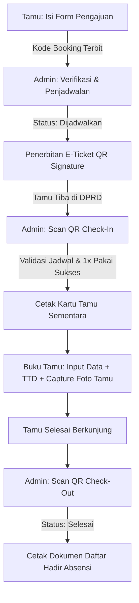

# 🏛️ SIM-KUNJUNGAN DPRD KOTA BANJARMASIN
> **Sistem Informasi Manajemen Pelayanan Kunjungan Kerja & Buku Tamu Digital Berbasis QR Code Anti-Copy**

Aplikasi berbasis web untuk digitalisasi tata kelola penerimaan permohonan kunjungan kerja, verifikasi jadwal, penerbitan E-Ticket QR Code tersertifikasi digital (*Anti-Copy HMAC-SHA256*), presensi kehadiran buku tamu digital dengan capture foto langsung, serta pencatatan kepulangan (*Check-Out*) pada Sekretariat DPRD Kota Banjarmasin.

---

## 🌟 Fitur Utama Sistem

### 1. 📋 Pengajuan Kunjungan Online (Publik)
- Formulir permohonan kunjungan online bagi instansi/masyarakat luar.
- Upload surat permohonan resmi (`.pdf`, `.jpg`, `.png`, maks. 5MB).
- Otomatis membuat **Kode Booking Unik** (contoh: `REQ-2026-8E14`).
- Pelacakan status permohonan secara mandiri di halaman **Cek Status**.

### 2. 🔐 Keamanan QR Code Anti-Copy (Compact Token HMAC-SHA256)
- **Format Token Ringkas**: `KODE_BOOKING|TIMESTAMP|HASH_SIGNATURE` (Hanya ~35 karakter, titik QR renggang sehingga sangat cepat di-scan).
- **Digital Signature**: Setiap QR Code ditandatangani menggunakan `HMAC-SHA256` dengan kunci rahasia server untuk mencegah pemalsuan/duplikasi tiket.
- **Validasi Jadwal Ketat**: QR Code hanya dapat digunakan pada tanggal kunjungan yang sah (Hari H).
- **Deteksi Expired Otomatis**: QR Code otomatis kedaluwarsa jika jadwal kunjungan telah terlewati.
- **Single-Use Check-In Rule**: QR Code hanya berlaku 1x Check-In, sistem otomatis menolak pemindaian ganda.

### 3. 📷 Pemindai Multi-Perangkat (Check-In & Check-Out)
- **Check-In Kedatangan (`scan_qr.php`)**: Memindai E-Ticket kedatangan via Webcam Laptop, Kamera HP, maupun Barcode Scanner USB fisik.
- **Check-Out Kepulangan (`scan_qr_checkout.php`)**: Memindai QR pada Kartu Tamu Sementara saat kepulangan untuk mengubah status kunjungan menjadi **Selesai** dan mencatat waktu pulang secara otomatis.

### 4. ✍️ Buku Tamu Digital & Capture Foto Peserta
- **Live Camera Capture**: Pengambilan foto wajah tamu langsung dari kamera laptop/webcam/USB camera dengan dropdown pemilihan perangkat kamera dan tombol bidik.
- **Upload Foto**: Opsi alternatif upload file gambar foto tamu.
- **Tanda Tangan Digital**: Fitur tanda tangan digital interaktif berbasis HTML5 Canvas (*Signature Pad*).
- **Pencatatan Peserta Rombongan**: Pendataan detail nama, jabatan, instansi, dan nomor handphone setiap peserta.

### 5. 🖨️ Penerbitan Dokumen Resmi Ber-KOP DPRD
- **Cetak E-Ticket Tamu** (`cetak_tiket.php`)
- **Cetak Kartu Tamu Sementara** (`kartu_tamu.php`)
- **Cetak Lembar Daftar Hadir Resmi** (`cetak_absensi.php`) lengkap dengan foto peserta dan tanda tangan asli.

---

## 🛠️ Arsitektur & Teknologi

| Komponen | Teknologi yang Digunakan |
| :--- | :--- |
| **Backend** | PHP 8.x (Native / Procedural) |
| **Database** | MySQL / MariaDB |
| **Frontend** | HTML5, CSS3, JavaScript (ES6), Bootstrap 5 |
| **Template UI** | Able Pro Responsive Dashboard Template & Tabler Icons |
| **Library Scanner** | `html5-qrcode` (Webcam & Hardware QR Scanning) |
| **Library Signature** | HTML5 Canvas Touch & Mouse Draw API |
| **Environment** | Laragon / XAMPP / WampServer |

---

## 🗄️ Struktur Database (`db_smart_guest.sql`)

- **`kunjungan`**: Menyimpan data pengajuan permohonan kunjungan, jadwal, ruangan, penanggung jawab, status permohonan, status kehadiran, file surat, token QR, dan timestamp check-in/check-out.
- **`buku_tamu`**: Menyimpan data peserta rombongan, tanda tangan digital, file `foto_tamu`, dan waktu hadir.
- **`ruangan`**: Master data ruangan rapat/audiensi DPRD.
- **`penanggung_jawab`**: Master data pejabat / penerima tamu yang ditugaskan.
- **`kategori_kunjungan`**: Master kategori (Audiensi, Studi Tiru, Kunjungan Kerja, Konsultasi).
- **`admin`**: Kredensial akun login staf pengelola.

---

## 🚀 Panduan Instalasi & Penggunaan Lokal

### 1. Prasyarat
- Web Server Lokal (Disarankan menggunakan **Laragon** atau **XAMPP** dengan PHP $\ge$ 7.4 / 8.x).
- Web Browser modern (Google Chrome, Microsoft Edge, atau Mozilla Firefox).
- Akses kamera webcam (untuk fitur scan dan capture foto tamu).

### 2. Langkah Instalasi
1. Clone repositori ini ke direktori web root Anda:
   ```bash
   # Jika menggunakan Laragon:
   cd C:/laragon/www/
   git clone https://github.com/eternalsugarzy/sistem-kunjungan-dprd.git
   
   # Atau jika menggunakan XAMPP:
   cd C:/xampp/htdocs/
   git clone https://github.com/eternalsugarzy/sistem-kunjungan-dprd.git
   ```

2. Buat database baru di **phpMyAdmin** / **HeidiSQL**:
   - Nama Database: `db_smart_guest`

3. Import file database:
   - Import file `db_smart_guest.sql` yang ada di root direktori proyek ke dalam database `db_smart_guest`.

4. Sesuaikan konfigurasi database di file `koneksi.php` (jika diperlukan):
   ```php
   $host = "localhost";
   $user = "root";
   $pass = "";
   $db   = "db_smart_guest";
   $qr_secret_key = "DPRD_SECRET_KEY_2026"; // Kunci rahasia signature QR
   ```

5. Pastikan folder upload memiliki izin tulis:
   - `uploads/`
   - `uploads/qr/`
   - `uploads/ttd/`
   - `uploads/foto_tamu/`

---

## 🔑 Kredensial Login Default Admin

- **URL Admin**: `http://localhost/sistem-kunjungan-dprd/admin/login.php`
- **Username**: `admin`
- **Password**: `admin`

---

## 🧭 Alur Kerja Sistem (Workflow)



---

## 👤 Pengembang
- **Nama**: Muhammad / EternalSugarzy
- **Instansi**: Sekretariat DPRD Kota Banjarmasin / Tugas Akhir Informatika
- **Tahun**: 2026

---
*Dibuat untuk memenuhi standar pelayanan publik berbasis digital modern.*
