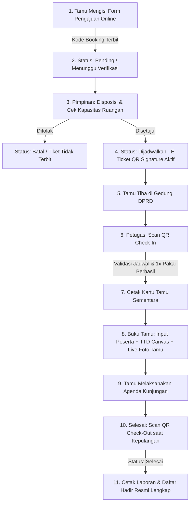

# 🏛️ SIM-KUNJUNGAN DPRD KOTA BANJARMASIN
> **Sistem Informasi Manajemen Pelayanan Kunjungan Kerja & Buku Tamu Digital Berbasis QR Code Anti-Copy (HMAC-SHA256)**

[](https://php.net)
[](https://mysql.com)
[](https://getbootstrap.com)
[](#)
[](#)

Aplikasi web modern untuk mendigitalisasi dan mengamankan seluruh siklus pelayanan tamu dan kunjungan kerja di **Sekretariat DPRD Kota Banjarmasin**. Mulai dari pengajuan online, otorisasi pimpinan ber-TTE dengan validasi kapasitas ruangan, penerbitan E-Ticket QR Code tersertifikasi digital (*Anti-Copy*), presensi kehadiran buku tamu digital dengan live photo capture, hingga pencatatan kepulangan (*Check-Out*).

---

## 🌟 Fitur Unggulan & Standar Keamanan Sistem

### 1. 📋 Pengajuan Kunjungan Mandiri (Publik)
- Formulir publik responsif untuk instansi pemerintah/lembaga masyarakat luar daerah.
- Upload surat permohonan resmi (`.pdf`, `.jpg`, `.png`, maks 5MB).
- Otomatis membuat **Kode Booking Unik** (Format: `REQ-YYYY-XXXX`).
- **Proteksi Anti Double-Input**: Mencegah instansi yang sama mengajukan permohonan ganda pada tanggal & jam yang persis sama.
- Pelacakan status permohonan secara mandiri di halaman **Cek Status**.

### 2. 👔 Disposisi Pimpinan & Validasi Kapasitas Ruangan
- **Validasi Kapasitas Ruangan vs Jumlah Peserta**: Sistem otomatis memeriksa kapasitas ruangan terhadap jumlah rombongan. Jika kapasitas ruangan tidak mencukupi (misal: peserta 40 orang di ruangan berkapasitas 25 orang), sistem menolak dan meminta memilih ruangan yang memadai.
- **Validasi Anti Double-Booking Ruangan**: Mencegah 2 kunjungan berbeda dijadwalkan pada ruangan yang sama di tanggal & jam yang bentrok.
- **Otorisasi TTE Pimpinan**: Penerbitan lembar disposisi resmi bertanda tangan elektronik (TTE).
- **Aktivasi Tiket Final**: E-Ticket QR Code **hanya aktif dan dapat dicetak** setelah permohonan disetujui (*Approved*) oleh pimpinan.

### 3. 🔐 Keamanan QR Code Anti-Copy (Compact Token HMAC-SHA256)
- **Format Token Ringkas**: `KODE_BOOKING|TIMESTAMP|HASH_SIGNATURE` (Hanya ~35 karakter).
  $$\text{Contoh: } \texttt{REQ-2026-8E14|1787931400|e659c32d3a}$$
- **Pemindaian Secepat Kilat (< 0.1 Detik)**: Karena karakter pendek, matriks QR sangat renggang sehingga langsung fokus dan terbaca instan oleh kamera laptop, HP, maupun barcode scanner USB.
- **Verifikasi Digital Signature**: Setiap QR Code diverifikasi dengan kunci rahasia server (`HMAC-SHA256`). Tiket yang diubah/dipalsukan akan langsung ditolak sistem.
- **Validasi Jadwal Hari H**: Tiket hanya berlaku pada tanggal kunjungan resmi.
- **Deteksi Expired Otomatis**: Tiket otomatis kedaluwarsa jika jadwal telah berlalu atau sesi telah selesai.
- **Single-Use Check-In Rule**: QR Code hanya berlaku 1x Check-In, mencegah pemindaian berulang kali.

### 4. 📷 Pemindai Multi-Perangkat (Check-In & Check-Out)
- **Check-In Kedatangan (`scan_qr.php`)**: Memindai QR E-Ticket via Kamera Webcam/HP atau Barcode Scanner USB fisik, mencatat status `sedang berkunjung`, dan menerbitkan Kartu Tamu Sementara.
- **Check-Out Kepulangan (`scan_qr_checkout.php`)**: Memindai QR Kartu Tamu saat pulang, otomatis mencatat `waktu_checkout = NOW()`, mengubah status menjadi `selesai`, dan menolak check-out ganda.

### 5. ✍️ Buku Tamu Digital & Live Camera Photo Capture
- **Live Camera Capture**: Mengambil foto wajah tamu langsung dari kamera laptop/webcam/USB camera dengan dropdown pemilihan device kamera dan tombol snapshot.
- **Upload File Foto**: Opsi alternatif unggah file foto dari galeri/komputer.
- **Tanda Tangan Digital**: Tanda tangan langsung pada layar menggunakan HTML5 Canvas (*Signature Pad*).
- **Proteksi Anti Double-Guest**: Mencegah penginputan nama peserta yang sama dua kali dalam 1 kunjungan.

### 6. 🖨️ Cetak Dokumen Resmi Ber-KOP DPRD Kota Banjarmasin
- **Cetak E-Ticket Tamu** (`cetak_tiket.php`)
- **Cetak Kartu Tamu Sementara** (`kartu_tamu.php`)
- **Cetak Lembar Disposisi Ber-TTE** (`admin/cetak_disposisi_tte.php`)
- **Cetak Lembar Daftar Hadir Tamu** (`admin/cetak_absensi.php`) lengkap dengan foto dan tanda tangan asli peserta.

---

## 🧭 Alur Kerja Sistem (Workflow Diagram)



---

## 🛠️ Tech Stack & Library

| Komponen | Spesifikasi & Library |
| :--- | :--- |
| **Backend Engine** | PHP 8.x Native (Procedural with MySQLi Prepared Security) |
| **Database** | MySQL / MariaDB (Relational with Foreign Keys & Cascading) |
| **Frontend UI** | HTML5, CSS3, JavaScript ES6, Bootstrap 5.3, Tabler Icons |
| **Admin Template** | Able Pro Modern Responsive Admin Dashboard |
| **QR Engine** | QRServer API + `html5-qrcode` Library (Autofocus Webcam & USB Scanner) |
| **Canvas Signature** | HTML5 Canvas Touch & Mouse Draw API |
| **Cryptography** | `HMAC-SHA256` Digital Signature Verification |

---

## 🗄️ Skema Database Utama (`db_smart_guest.sql`)

- **`kunjungan`**: Data induk pengajuan kunjungan, tanggal, jam, peserta, materi, file surat, penugasan ruangan, penanggung jawab, status permohonan, status kehadiran, QR payload token, serta timestamp check-in/check-out.
- **`buku_tamu`**: Data peserta rombongan, tanda tangan digital, file `foto_tamu`, dan waktu hadir.
- **`ruangan`**: Master data ruangan rapat/audiensi DPRD beserta kapasitas maksimal dan lokasi lantai.
- **`penanggung_jawab`**: Master data pejabat/staf penerima tamu (NIP, Jabatan, Pangkat/Golongan, file TTD).
- **`jadwal_pejabat`**: Jadwal ketersediaan penanggung jawab (hari, jam mulai, jam selesai).
- **`kategori_kunjungan`**: Master kategori (Audiensi, Studi Tiru, Kunjungan Kerja, Konsultasi).
- **`admin`**: Kredensial akun pengelola sistem.

---

## 🚀 Panduan Instalasi & Penggunaan Lokal

### 1. Prasyarat
- Web Server Lokal (**Laragon** disarankan, atau **XAMPP** dengan PHP $\ge$ 7.4 / 8.x).
- Web Browser modern (Google Chrome, Microsoft Edge, atau Mozilla Firefox).
- Kamera Webcam / USB Camera aktif (untuk fitur scan dan capture foto tamu).

### 2. Langkah Instalasi
1. Clone repositori ini ke folder root web server Anda:
   ```bash
   # Laragon
   cd C:/laragon/www/
   git clone https://github.com/eternalsugarzy/sistem-kunjungan-dprd.git
   
   # XAMPP
   cd C:/xampp/htdocs/
   git clone https://github.com/eternalsugarzy/sistem-kunjungan-dprd.git
   ```

2. Buat database baru di **phpMyAdmin** / **HeidiSQL**:
   - Nama Database: `db_smart_guest`

3. Import file database:
   - Import file `db_smart_guest.sql` yang ada di root direktori proyek.

4. Konfigurasi koneksi database di file `koneksi.php`:
   ```php
   $host = "localhost";
   $user = "root";
   $pass = "";
   $db   = "db_smart_guest";
   $qr_secret_key = "DPRD_SECRET_KEY_2026"; // Secret key signature QR
   ```

5. Pastikan folder penyimpanan asset dapat ditulis (*writable*):
   - `uploads/`
   - `uploads/qr/`
   - `uploads/ttd/`
   - `uploads/foto_tamu/`

---

## 🔑 Kredensial Login Default

- **URL Portal Publik**: `http://localhost/sistem-kunjungan-dprd/`
- **URL Admin Panel**: `http://localhost/sistem-kunjungan-dprd/admin/login.php`
- **Username Admin**: `admin`
- **Password Admin**: `admin`
- **Passphrase TTE Pimpinan**: `pimpinan123`

---

## 👤 Pengembang Proyek
- **Pengembang**: Muhammad / EternalSugarzy
- **Institusi**: Sekretariat DPRD Kota Banjarmasin / Tugas Akhir Informatika
- **Tahun**: 2026

---
*Dikembangkan dengan standar kualitas rekayasa perangkat lunak, keamanan data terenkripsi, dan kepatuhan revisi akademik.*
